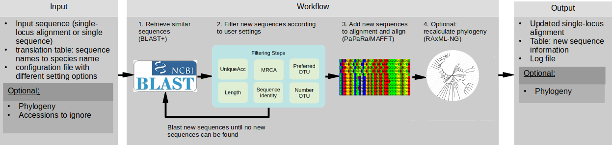

 

# PhylUp - generating phylogenetic alignments with custom sampling across taxonomic ranks

   
    
## Short introduction

A preprint is available on [biorxiv](https://www.biorxiv.org/content/10.1101/2020.12.21.394551v1). 

PhylUp is a command-line program written in python3 to automatically generate alignments 
(or update alignments and phylogenies) with a focus on different sampling strategies across taxonomic ranks.
As input it needs a single sequence (or alignment and if available a phylogeny) and 
a file with the information about the sequence names and the corresponding species names. 
PhylUp will take every input sequence and blasts it against a sequence database, 
either a local copy of Genbank or a user supplied database. 
Sequences that are similar to the input sequence will be added, 
if they are a different taxon and/or they are longer than existing sequences.
Sequences are then filtered according to user settings provided in the configuration file.
Newly found and filtered sequences will be blasted again until no new sequences are found.
Finally, it will place the newly found sequences into the alignment and if enabled calculate (or update) the phylogeny.

After single-gene datasets are updated, the data can be [concatenated](https://github.com/mkandziora/phylogenetic_concatenation). 

## Tutorial

To get started please view the Wiki for more details.

## Examples

To get started I provide several example files in the folder `example_setups`. 
They are ordered by complexity of the analyses.

The provided examples files are intended to show the user how to set up their own analyses and configuration files, 
and are not necessarily generating meaningful and completely sampled alignments of the clade of interest. 
Instead they are made to quickly show the purpose.
Needed data files are provided in `data`.

 * The file `01_example_aln_simple.py` updates an alignment, 
    to include a maximum of 5 samples per species within the genus *Senecio*.
 * The file `01_example_singleseq_simple.py` generates an alignment based on a single seed sequence, 
    to include a maximum of 5 samples per species within the genus *Senecio*.
 * The file `02_example_aln_multiple_mrca.py` updates an alignment to sequences 
    belonging to different mrca as defined in the configuration file.
 * The file `02_example_aln_notree.py` updates an alignment without providing a phylogeny. 
 * The file `03_example_aln_addunpublishedsequences.py` updates an alignment with sequences 
    from a user supplied database - see `data/unpublished_seqs` for an example on how it needs to look.
 * The file `03_example_aln_downto_genus.py` updates an alignment, 
    including 10 samples per genus for the tribe Senecioneae.
 * The file `04_example_different_rank_sampling.py` updates an alignment, 
    to include different numbers of samples per defined taxonomic rank: 
    1 sample per species within *Senecio*, 2 samples per genus within Senecioneae and 
    two samples per tribe for Asteroideae. This kind of setup for example is often used to generate alignments for 
    molecular dating including fossils from different branches of the phylogeny.
 * The file `04_example_multiple_loci.py` updates different loci for a given clade of interest 
    using the preferred taxon option to increase sampling across loci. The different settings of the two `04_example` can also be combined.
 
 Please submit an issue in case things are unclear or are not working.
  
