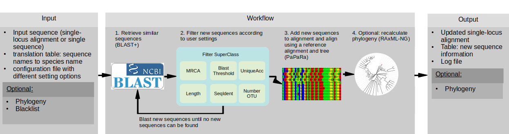

# PhylUp - updating of phylogenetic alignments with custom sampling
   
    
## Short introduction to the tool:

PhylUp is a command-line tool written in python3 to automatically update alignments and phylogenies with a focus on different sampling strategies.
As input it needs a alignment or a single sequence (and if available a phylogeny) and 
a file with the information about the sequence names and the corresponding species names. 
PhylUp will take every input sequence and blasts it against the ncbi GenBank database. 
Sequences that are similar to the input sequence will be added to the alignment, 
if they are a different taxon and/or they are longer than existing sequences.
They are then filtered to user settings provided in the configuration file.
Newly found and filtered sequences will be blasted again until no new sequences were found.
Finally, it will place the newly found sequences into the alignment and if enabled to update phylogenies.

After the single-gene datasets are updated, the data can be concatenated. 
The tool decides randomly which sequences to combine if there are more than a single sequence for a taxon in one of the alignments.

## Tutorial:

### Before you can start

#### 1. install the dependencies:

* [PaPaRa](http://sco.h-its.org/exelixis/web/software/papara/index.html) - alignment tool
* [RAxML-NG](https://github.com/amkozlov/raxml-ng/archive/master.zip) - tree estimation program
* [BLAST+](https://blast.ncbi.nlm.nih.gov/Blast.cgi?CMD=Web&PAGE_TYPE=BlastDocs&DOC_TYPE=Download) - It needs blast+ v.2.9 or higher. It is needed for filter runs and when using local BLAST databases. Setup and installation information can be found [here](https://www.ncbi.nlm.nih.gov/books/NBK1762/).
* [EPA-NG](https://github.com/Pbdas/epa-ng/archive/master.zip) - places new sequences into the phylogeny
* [gappa](https://github.com/lczech/gappa/archive/master.zip) - transforms the output from EPA-NG into a readable output
* [MAFFT](https://mafft.cbrc.jp/alignment/software/linux.html) - alignment tool if a single sequence was provided as input.

On a Linux machine check [here](./install_req.bash) for an example bash code on how to install the required dependencies.

make sure the programs are accessible from everywhere, thus add them to your PATH using the command line:
* UNIX: `export PATH=$PATH:/path/to/my/program`
* Windows: `set PATH=%PATH%;C:\path\to\my\program`
* MAC: `export PATH=$PATH:~/path/to/program`

#### 2.a) download PhylUp using the command line:
* as a normal package: `wget  https://github.com/blubbundbla/PhylUp/archive/master.zip`
* as a git repository: `git clone 'git@github.com:blubbundbla/PhylUp.git'`

#### 2.b) optional: install a virtual environment
  This is very useful if you want to run it on a cluster and/or do not want to change already installed python packages on your computer.
  A virtual environment will locally install the packages needed.

  `pip install virtualenv` 
  `virtualenv -p python3 NameOfYourENV`  # you may need to just say `python` instead of `python3`, depending on your system

  To use the virtual machine you need to activate it before doing anything else. 
  This needs to be done before you start installing software in your virtual maschine or before running PhylUp.

  `source NameOfYourENV/bin/activate`

  and to deactivate it: `deactivate`

#### 3. install python requirements and dependencies:

run from within the PhylUp main folder:

* `python setup.py install`
* `pip install -r requirements.txt`

#### 4. install a local instance of the BLAST database: 

  General information about the BLAST database can be found here: ftp://ftp.ncbi.nlm.nih.gov/blast/documents/blastdb.html.
 
  *  **Install the blast database:**
  
      On a  Linux machine to install the BLAST database do the following:
    
      * `open a terminal`
      * `cd /to/the/folder/of/your/future/blastdb`  
      * `wget 'https://ftp.ncbi.nlm.nih.gov/blast/db/nt.*'`  # this downloads all nt-compressed files
      * `cat *.tar.gz | tar -xvzf - -i`  # macOS `tar` does not support the `-i` flag,  you need to use homebrew to `brew install gnu-tar` and replace the `tar` command by `gtar`
      * `blastdbcmd -db nt -info`  # checks if it works
      * `rm *.tar.gz*`
        
      'nt' means, we are making the nucleotide database.
          
       
  *  **Install the taxonomy database:**
      
      install ncbi taxonomy database to retrieve taxon information from BLAST searches into the same directory as your blastdb from the step before.
                
        * `cd /to/the/folder/of/your/blastdb`
        * `wget 'ftp://ftp.ncbi.nlm.nih.gov/blast/db/taxdb.tar.gz'` # Download the taxdb archive
        * `gunzip -cd taxdb.tar.gz | (tar xvf - )`  # Install it in the BLASTDB directory
        * `rm *.tar.gz*`

  * **Install the taxonomic rank database:**
       *  `wget 'ftp://ftp.ncbi.nlm.nih.gov/pub/taxonomy/taxdump.tar.gz'`
       *  `gunzip  -cd taxdump.tar.gz | (tar xvf - names.dmp nodes.dmp)`  
       *  move files into `data/`
       *  `rm taxdump.tar.gz`

         
  * **Update the databases:**       
    
    The databases need to be updated regularly, the program will check the dates of your databases and will remember you to update the databases. If you set your analysis to run interactive and your databases are older, you will be asked for input, if you want to update them. 
    Please note, that the interactive mode does not work on remote machines with scheduling systems, to stop the program from asking, change the following line in your analysis file from `conf = ConfigObj(configfi, workdir)` to `conf = ConfigObj(configfi, workdir,  interactive=False)`.
    
    If you want to update the databases by hand:

       * blast db: repeat the steps listed under 'Install a local Blast database'
       * taxonomy db: run `update_blastdb taxdb`
       * rank db: repeat the steps listed under 'install the taxonomic rank database'
   
   
   
### Set up a run

#### **1. edit major settings in the config file**

There is an example config file in `./data/localblast.config`
  * **General settings**:
    * **num_threads**: defines how many cores shall be used for the blasting and other parallelized parts
    * **mrca**: ncbi taxonomy ID; this is optional and the user can also provide several ID's (e.g. mrca = 1, 2, 3).
                Often phylogenies include outgroups, and someone might not be interested in updating that part of the tree. 
                This can be avoided by defining the most recent common ancestor. 
                It requires the ncbi taxon identifier for the group of interest, which can be obtained from [here](https://www.ncbi.nlm.nih.gov/taxonomy) or by using a provided script:

	    `python3 ./data/spn_to_taxid.py NAME_OF_MRCA`

	    Please note that in the case that the mrca is a species name, the space between the two words needs to be replaced with an '_'

  * **unpublished sequence settings**:
    * **unpublished**: True or False; if additional database shall be used
    * **unpubl\_data**: Path to folder with files - no files other than unpublished sequences are allowed
    * **unpubl\_names**: path to file with unique name and taxon name; needs to be in a different folder than the unpublished sequences
    * **perpetual**: True or False; False, if the input sequences shall only be blasted against the unpublished database a single time
    * **blast\_all**: True or False; BLAST original input plus the newly added during the following Genbank search or only the newly added once
   
  * **BLAST settings**:
    * **blast\_type**: must be either 'Genbank' or 'own' (own is a folder with FASTA formatted sequences)
    * **taxid\_map**: only needed if option blast\_type is set to own; provide path to file that contains a   translation table (sequence name, species name)
    * **localblastdb**: path to local blast database; path must end with a '/' 
    * **e_value_thresh**: 
      This is the e-value that can be retrieved from BLAST searches and is used to limit the BLAST results to sequences that are similar to the search input sequence.
      It is a parameter that describes how many hits can be expected by chance from a similar-sized database during BLAST searches. Small e-value indicate a significant match. In general, shorter sequences have lower e-values, because shorter sequences have a higher probability to occur in the database by chance. For more information please refer to the ncbi BLAST resources (e.g. \url{https://blast.ncbi.nlm.nih.gov/Blast.cgi?CMD=Web&PAGE_TYPE=BlastDocs}).
      We used an e-value of 0.001 for all example datasets.
    * **hitlist_size**: 
      This specifies the amount of sequences being returned from a BLAST search. If your phylogeny does not contain a lot of nodes, it can be a low value, which will speed-up the analysis. If the sampled lineage contains many sequences with low sequence divergence it is better to increase it to be able to retrieve all similar sequences. It is not advised to have a really low hitlist size, as this will influence the number of sequences that will be added to your alignment. Low hitlist sizes might not return all best-matches but only the first 10 even though there might be more best-matches in the database \citep{shah_misunderstood-2018}. Furthermore, for example, if the hitlist size is 10, but the phylogeny which shall be updated is sparsely sampled, this might result in an updated phylogeny, that has only the parts of the phylogeny updated, that were present in the input phylogeny. Lineages that were not present might never be added, as the 10 best hits all belong to the lineages already present. 
    * **fix\_blast\_result\_folder**:  True or False; True will use same blast folder across runs - be careful - if input sequences across runs have different loci this will not update the results as it uses files which exists. Furthermore, if the blast settings above are changed all files need to be deleted.
       
  * **Alignment settings**:
    * **min_len:** minimum length a new sequence can have
    * **max_len**: maximum length of sequences that are added to alignment, must be greater than 1.
    * **trim_perc**: value that determines how many seq need to be present before the beginning and end of alignment will be trimmed
  
  * **Filter Settings**:
    * **filtertype:**   This defines how to filter the number of sequences per taxon.
        * **blast**:  All sequences belonging to a taxon will be used for a filtering blast search.
                        A sequence already present in the phylogeny, or a randomly chosen sequence, will be used to blast against all other sequences from the locus with the same taxon name.
                        From the sequences that pass the filtering criterium, sequences will be randomly selected as representative. The filtering criterium is that they need to be within the mean +/- standard deviation of sequence  similarity in relation to the queried sequence. See below for the explanation of the similarity value.
                          If the taxon is likely monophyletic the distances will be similar and thus all sequences will fall within the mean and standard deviation of sequence similarity.
                        If there are a few outlier sequences only, this seems to be likely a misidentification or mis-labeling in GenBank, outlier sequences will not be added, as they are most likely outside the allowed range of mean +/- SD.
                        If the taxon is likely not monophyletic and sequences diverge a lot from each other, the mean and SD will be larger and allows to randomly pick sequences, that represent the divergence.
                        As value for sequence similarity, we use bit-scores.  Bit-scores are log-scaled scores and a score is a numerical value that describes the overall quality of an alignment (thus from the blasted sequence against the other available sequences). Higher numbers correspond to higher similarity. While scores are depending on database size, the rescaled bit-scores do not. Check out https://www.ncbi.nlm.nih.gov/BLAST/tutorial/Altschul-1.html for more detail.
                        From the sequences that path the sequence similarity, random sequences are chosen.
        * **length**:  Instead of randomly choosing between sequences that are within the criteria of the blast search using sequence divergence as a criteria, here the longest sequences will be selected.

    * **threshold:** This defines the maximum number of sequences per taxon (e.g. species) to be retrieved.
                       If your input dataset already contains more sequences, there will be no additional sequences added, but also not removed.
    * **downtorank**: This defines the rank which is used to determine the maximum number of sequences per taxon.
                     It can be set to None and then for all taxa, there will be the maximum number of threshold sequences retrieved.
                    If it is set to species, there will no more than the maximum number of sequences randomly choosen from all sequences available for all the subspecies.
                        It can be set to any ranks defined in the ncbi taxonomy browser.
    * **different_level:** True or False. Makes hierarchical adding of sequences possible - see Asteroideae example.
    * **identical\_seqs:** True or False; set to True if identical sequences shall be kept
        
  * **Tree Calculation**:
    * **update_tree:** True or False. Set to true if you want to calculate an updated phylogeny from within the program. Often not advisable as HighPerformanceClusters are often set up in different ways and the tool might not make the use of the power of the cluster.

    * **backbone:** True or False. Set to true if you only want to add new sequences to existing tree, without recalculating the full tree. 
    * **modeltest\_criteria:** must be BIC, AIC or AICc; defined which information criterion is used to select substitution model for the alignment
       
  * **Internal settings:**
    * **nodes\_fn:** path to nodes file from ncbi, is usually downloaded automatically and placed in the provided path
    * **names\_fn:** path to names file from ncbi, is usually downloaded automatically and placed in the provided path
       
  

#### **2. write your analysis file**
##### A. standard run 

This is explaining how to set up an analysis, which will add sequences, that are similar and long enough 
to the alignment as long as they are no subsequences of an already existing sequence, until the taxon reached the threshold.

The sequences retrieved from the BLAST search/during a the updating are being filtered according to some user input. This is particularly of use, if there is no need to have every single sequence available being represented in your phylogeny.

Optional arguments are explained in the following section.

There is an example file in `example_analysis.py`, it comes with a tiny sample dataset in `tests/data/tiny_example`.

* **seqaln**: give the path to your alignment file, must be a single gene alignment
* **mattype**: file format of your alignment - currently supported: “fasta”, “newick”, “nexus”, “nexml”, “phylip”
* **trfn**: give the path to the file containing the corresponding phylogeny, all tips must be represented in the alignment file as well.
* **schema_trf**: file format of your phylogeny file - currently supported: “fasta”, “newick”, “nexus”, “nexml”, “phylip”
* **id_to_spn**: path to a comma-delimited file where tip labels correspond to species names: example file can be found in `tests/data/tiny_test_example/test_nicespl.csv`. Species names must be provided with '_' rather than a 'whitespace', also for species epithets with a '-' in its name.
* **workdir**: path to your working directory, the folder where intermediate and result files shall be stored.
* **configfi**: path to your config-file, which was edited in step 1.

Note: Specified paths have to start either from your root directory (e.g. `/home/USER/PhylUp/path/to/file`), or can be relative from within the PhylUp main folder (`./path/to/file`).

Beside the standard definition, there are more input options. Currently supported are:
* **blacklist**: A list of sequences, that shall not be added or were identified to be removed later. This needs to be formatted as a python list containing the GenBank identifiers (e.g. `[accession number, accession number]`).
* **status_end**: This is an option to tell the program how often to run the blast searches. If it is set to 1, it will only blast the input sequences once and adds those found to the alignment. If it is set to 2, it will blast the newly retrieved sequences from the initial blast search and adds those results to the alignment as well. As such the input plus the first round of newly found sequences is blasted. If it is set to 3, it will add one more 'round', etc... 

##### B. hierarchical updating - Asteroideae example:

Update an alignment with different settings of mrca, threshold and downtorank settings.

There is an example file in `example_different_levels.py`.

##### C. Add unpublished data

 Instead of using GenBank as the source of new sequences, we can specify a folder which contains sequences in fasta format and this folder will be used as a sequence database. 
 Before using the BLAST database to find new sequences, sequences from that folder can be added to the alignment/phylogeny if the folder contains sequences that are similar to the sequences already present in the alignment. This is intended to be used for newly sequenced material, which is not yet published on GenBank.
     To use this you need to adapt the unpublished sequence settings.
     
   There is an example file in `example_unpublished.py`, with an example of the input files in `./data/unpublished_seqs` and `./data/unpublished_names.csv` shows how to write the comma-delimited file.

#### **3. start to update your alignment:**

This should be straight forward - type in your PhylUp main folder:

`python3 ./path/to/file/analysis-file.py`

And now you just need to wait...

#### **4. Concatenate different single-gene PhylUp runs:**
    
After the single-gene PhylUp runs were updated, the data can be combined using [phylogenetic concatenation](https://github.com/blubbundbla/phylogenetic_concatenation.git), see for example `example_concat.py`.

#### **5. Navigating the output:**

During a PhylUp run, several files are being written out:
Here is a short introduction to what they are:
 * **all_new_seqs.updated**: csv file with all information available about the newly added sequences
 * **fulltree.raxml.**: all the files generated by RAxML-NG if the tree updating was enabled
 * **logfile**: short summary of how many sequences where added/filtered during a PhylUp run
 * **table.updated**: all sequences that were considered to be added, but of which some have been removed because of the filtering steps - does not include sequences that were not added because they are not part of the mrca or because they were too short - for those see wrong_mrca.csv and wrong_seq_length.csv
 * **updt_aln.fasta**: updated alignment; there is also a relabeled version with tipnames as a combination of taxon name and accession number
 * **updt_tre.tre**: updated tree or unresolved tree if no phylogeny was provided as input; there is also a relabeled version with tipnames as a combination of taxon name and accession number
 * **orig_inputaln.fasta**: data as supplied in the input
 * **orig_tre.tre**: data as supplied in the input
 * **blast**: folder that holds all blast results
 * **tmp**: folder that holds taxonomic information, complete sequences and internally used files.

 #### **6. Common error messages:**

Will be added as soon it becomes clear what are common error messages.

### If you want to run some tests

run:

 `python3 ./tests/tests_setup.py`
 
 `pytest tests/test_*`

  
